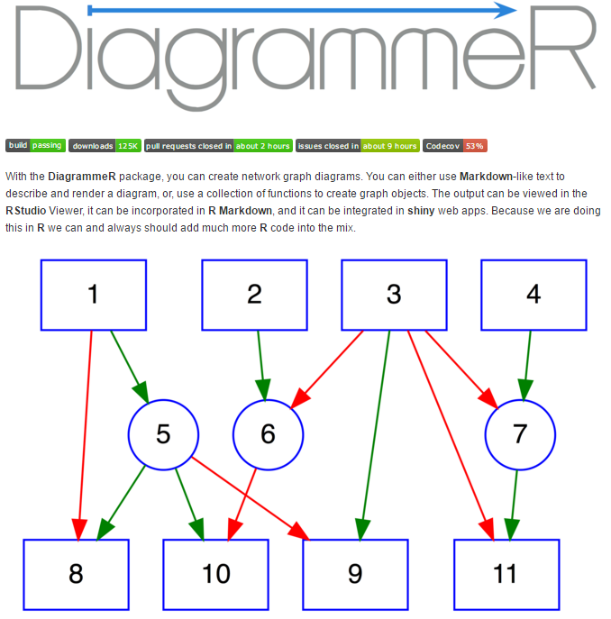

```{r setup, echo = FALSE}
knitr::opts_chunk$set(
  message = FALSE,
  warning = FALSE,
  fig.width = 10,
  fig.height = 4,
  comment = "#>",
  collapse = TRUE
)
```

<style type="text/css">
body {
  background: black;
}
</style>


## Introduction

<iframe width=750 height=500 frameborder="0" seamless="seamless" src="https://imdevsoftware.wordpress.com/2016/02/28/network-visualization-with-plotly-and-shiny/"> </iframe>
  
--- 

## Networks as Visualization Tools

<iframe width=750 height=500 frameborder="0" seamless="seamless" scrolling="yes" src="http://dgrapov.github.io/MetaMapR/gallery.html"> </iframe>

--- 

## Network Visualization in R
# igraph

<iframe width=750 height=500 frameborder="0" seamless="seamless" scrolling="yes" src="http://igraph.org/"> </iframe>

--- 
  
## Lets Visualize a network
# Data set:
<iframe width=750 height=500 frameborder="0" seamless="seamless" scrolling="yes" src="https://networkdata.ics.uci.edu/data.php?id=105"> </iframe>


--- .class #id

## Karate Network in igraph
```{r,message=FALSE,warning=FALSE}
library(igraph)
karate <- make_graph("Zachary")
karate$layout <- layout_with_kk(karate)
plot(karate)
```

--- .class #id

## Identify Graph Modules
```{r}
fc <- cluster_fast_greedy(karate)
memb <- membership(fc)
plot(karate, vertex.color=memb)
```

--- .class #id

## Network Objects
# connections: edge list
```{r}
edge.list<-data.frame(get.edgelist(karate,names=TRUE))
edge.list$ID<-"friends"
head(edge.list)
```

---

## Network Objects
# objects: node attributes
```{r,message=FALSE,warning=FALSE}
nodes<-as.matrix(V(karate))
node.data<-data.frame(ID=nodes,group=as.matrix(memb))
#add color
node.data$color<-rainbow(length(unique(node.data$group)))[factor(node.data$group)]
#add size based on centrality
#rescale to 20-60
library(scales)
node.data$size<-rescale(closeness(karate, mode="all"),to=c(10,40))
head(node.data)
```

--- .class #id

## Plotly
<div align="center">

</div>

--- 

## Recreate Network in Plotly
```{r,eval=FALSE,message=FALSE,warning=FALSE}
library(networkly)
#net params
layout<-"kamadakawai"
type<-"2d"
color<-'color'
size<-'size'
name<-'ID'
obj<-get_network(edge.list,type=type,layout=layout)

#create plotting attributes
net<-c(get_edges(obj,color=NULL,width=NULL,name=name,type=type,hoverinfo="none",showlegend=FALSE),
       get_nodes(obj,node.data,color=color,size=size,name=name,
                 type=type,hoverinfo="ID",showlegend=FALSE),
       get_text(obj,node.data,text=name,extra=list(textfont=list(size=20)),
                type=type,yoff=-5,hoverinfo="none",showlegend=FALSE))
#visualize
shiny_ly(net) 
```

--- 

## Recreate Network in Plotly (cont.)
```{r,eval=FALSE,message=FALSE,warning=FALSE}
legend<-c(format_legend(obj,nodes=FALSE,node.data=node.data,
                        width=NULL,size=NULL,name=name,color=NULL),#edge legend
          format_legend(obj,edges=FALSE,node.data=node.data,
                        size=NULL,name=NULL,color="group")) #node legend
          
net2<-c(net,c(get_edges(legend,color=NULL,width=NULL,
                        name=name,type=type,hoverinfo="none",showlegend=TRUE),
              get_nodes(legend,node.data=legend$node.data,color="group",size=NULL,
                        name="group",type=type,showlegend=TRUE,merge=FALSE)))

net<-shiny_ly(net2) 
#visualize and add layout variables
plotly::layout(net,
       xaxis = list(title = "", showgrid = FALSE, showticklabels = FALSE, 
                    zeroline = FALSE, hoverformat = '.2f'),
       yaxis = list(title = "", showgrid = FALSE, showticklabels = FALSE,
                    zeroline = FALSE, hoverformat = '.2f'))
```

--- 

## 2-D network
```{r, 'plotly1', echo=FALSE, warning=FALSE,cache=FALSE,results='asis'}
cat('<iframe src="./assets/widgets/2D_plotly.html" width=100% height=100% allowtransparency="true"> </iframe>')
```

--- 

## 3D Plotly Network
```{r,eval=FALSE,message=FALSE,warning=FALSE}
#differences from 2D = **
#net params
node.data$size<-rescale(closeness(karate, mode="all"),to=c(2,15)) # resize nodes for 3D **
layout<-"kamadakawai"
type<-"3d" # **
color<-'color'
size<-'size'
name<-'ID'
obj<-get_network(edge.list,type=type,layout=layout)

#create plotting attributes
net<-c(get_edges(obj,color=NULL,width=NULL,name=name,type=type,hoverinfo="none",showlegend=FALSE),
       get_nodes(obj,node.data,color=color,size=size,name=name,type=type,
                 hoverinfo="ID",showlegend=FALSE),
       get_text(obj,node.data,text=name,extra=list(textfont=list(size=20)),
                type=type,yoff=-5,hoverinfo="none",showlegend=FALSE))

```

---
## 3D Plotly Network (cont)
```{r,eval=FALSE,message=FALSE,warning=FALSE}
legend<-c(format_legend(obj,nodes=FALSE,node.data=node.data,
                        width=NULL,size=NULL,name=name,color=NULL),#edge legend
          format_legend(obj,edges=FALSE,node.data=node.data,
                        size=NULL,name=NULL,color="group")) #node legend


net2<-c(net,c(get_edges(legend,color=NULL,width=NULL,name=name,
                        type=type,hoverinfo="none",showlegend=TRUE),
              get_nodes(legend,node.data=legend$node.data,color="group",
                        size=NULL,name="group",type=type,showlegend=TRUE,merge=FALSE)))

net<-shiny_ly(net2) # with legend

# ***
plotly::layout(net,scene = list(showlegend=TRUE,
                  yaxis=list(showgrid=FALSE,showticklabels=FALSE,zeroline=FALSE,title=""),
                  xaxis=list(showgrid=FALSE,showticklabels=FALSE,zeroline=FALSE,title=""),
                  zaxis=list(showgrid=FALSE,showticklabels=FALSE,zeroline=FALSE,title="")))
```

--- 

## 3-D network
```{r, 'plotly2', echo=FALSE, warning=FALSE,cache=FALSE,results='asis'}
cat('<iframe src="./assets/widgets/3D_plotly.html" width=100% height=100% allowtransparency="true"> </iframe>')
```

--- 

# Embedding Networks in Shiny Apps

## `ui.R`
```{r,eval=FALSE}
shinyUI(bootstrapPage(
    plotlyOutput("network")
))

```
## `server.R` 
```{r,eval=FALSE}
shinyServer(function(session,input, output) {
  output$network<-renderPlotly({
    #network creation script goes here
    #see above for how to create 2d or 3d networks
    shiny_ly(net)
  })
})
```

--- 

# Shiny + Plotly Demo

```{r, eval=FALSE}
networkly::networklyShiny()
```

--- 

# Additional Resources
<h2><a href="https://github.com/rich-iannone/DiagrammeR" target="_blank">DiagrammeR</a></h2>
## For directed graphs +
<div align="center">

</div>

---

## About
* Last Updated: `r Sys.Date()`
* Contact: createdatasol@gmail.com

---

```{r,echo=FALSE,message=FALSE,warning=FALSE}
library(networkly)
library(plotly)
library(igraph)

sessionInfo()
```
