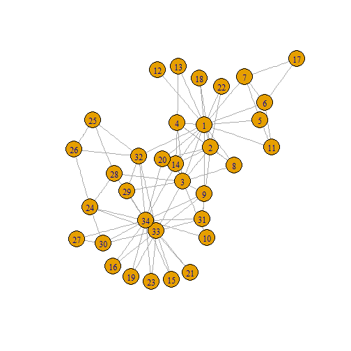
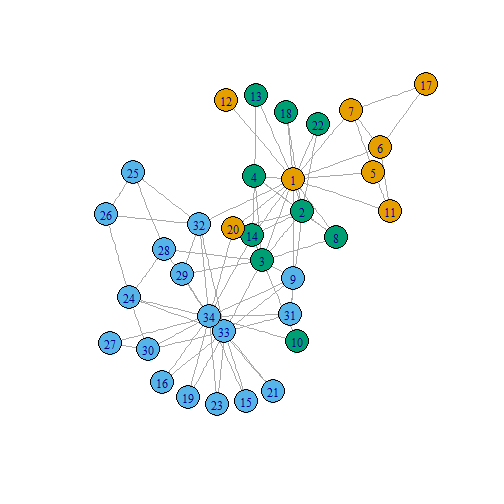

<style type="text/css">
body {
  background: black;
}
</style>


## Introduction

<iframe width=750 height=500 frameborder="0" seamless="seamless" src="https://imdevsoftware.wordpress.com/2016/02/28/network-visualization-with-plotly-and-shiny/"> </iframe>
  
--- 

## Networks as Visualization Tools

<iframe width=750 height=500 frameborder="0" seamless="seamless" scrolling="yes" src="http://dgrapov.github.io/MetaMapR/gallery.html"> </iframe>

--- 

## Network Visualization in R
# igraph

<iframe width=750 height=500 frameborder="0" seamless="seamless" scrolling="yes" src="http://igraph.org/"> </iframe>

--- 
  
## Lets Visualize a network
# Data set:
<iframe width=750 height=500 frameborder="0" seamless="seamless" scrolling="yes" src="https://networkdata.ics.uci.edu/data.php?id=105"> </iframe>


--- .class #id

## Karate Network in igraph

```r
library(igraph)
karate <- make_graph("Zachary")
karate$layout <- layout_with_kk(karate)
plot(karate)
```



--- .class #id

## Identify Graph Modules

```r
fc <- cluster_fast_greedy(karate)
memb <- membership(fc)
plot(karate, vertex.color=memb)
```



--- .class #id

## Network Objects
# connections: edge list

```r
edge.list<-data.frame(get.edgelist(karate,names=TRUE))
edge.list$ID<-"friends"
head(edge.list)
```

```
##   X1 X2      ID
## 1  1  2 friends
## 2  1  3 friends
## 3  1  4 friends
## 4  1  5 friends
## 5  1  6 friends
## 6  1  7 friends
```

---

## Network Objects
# objects: node attributes

```r
nodes<-as.matrix(V(karate))
node.data<-data.frame(ID=nodes,group=as.matrix(memb))
#add color
node.data$color<-rainbow(length(unique(node.data$group)))[factor(node.data$group)]
#add size based on centrality
#rescale to 20-60
library(scales)
node.data$size<-rescale(closeness(karate, mode="all"),to=c(10,40))
head(node.data)
```

```
##   ID group     color     size
## 1  1     1 #FF0000FF 40.00000
## 2  2     3 #0000FFFF 31.17647
## 3  3     3 #0000FFFF 38.98305
## 4  4     3 #0000FFFF 29.01408
## 5  5     1 #FF0000FF 20.00000
## 6  6     1 #FF0000FF 20.46512
```

--- .class #id

## Plotly
<div align="center">

</div>

--- 

## Recreate Network in Plotly

```r
library(networkly)
#net params
layout<-"kamadakawai"
type<-"2d"
color<-'color'
size<-'size'
name<-'ID'
obj<-get_network(edge.list,type=type,layout=layout)

#create plotting attributes
net<-c(get_edges(obj,color=NULL,width=NULL,name=name,type=type,hoverinfo="none",showlegend=FALSE),
       get_nodes(obj,node.data,color=color,size=size,name=name,
                 type=type,hoverinfo="ID",showlegend=FALSE),
       get_text(obj,node.data,text=name,extra=list(textfont=list(size=20)),
                type=type,yoff=-5,hoverinfo="none",showlegend=FALSE))
#visualize
shiny_ly(net) 
```

--- 

## Recreate Network in Plotly (cont.)

```r
legend<-c(format_legend(obj,nodes=FALSE,node.data=node.data,
                        width=NULL,size=NULL,name=name,color=NULL),#edge legend
          format_legend(obj,edges=FALSE,node.data=node.data,
                        size=NULL,name=NULL,color="group")) #node legend
          
net2<-c(net,c(get_edges(legend,color=NULL,width=NULL,
                        name=name,type=type,hoverinfo="none",showlegend=TRUE),
              get_nodes(legend,node.data=legend$node.data,color="group",size=NULL,
                        name="group",type=type,showlegend=TRUE,merge=FALSE)))

net<-shiny_ly(net2) 
#visualize and add layout variables
plotly::layout(net,
       xaxis = list(title = "", showgrid = FALSE, showticklabels = FALSE, 
                    zeroline = FALSE, hoverformat = '.2f'),
       yaxis = list(title = "", showgrid = FALSE, showticklabels = FALSE,
                    zeroline = FALSE, hoverformat = '.2f'))
```

--- 

## 2-D network
<iframe src="./assets/widgets/2D_plotly.html" width=100% height=100% allowtransparency="true"> </iframe>

--- 

## 3D Plotly Network

```r
#differences from 2D = **
#net params
node.data$size<-rescale(closeness(karate, mode="all"),to=c(2,15)) # resize nodes for 3D **
layout<-"kamadakawai"
type<-"3d" # **
color<-'color'
size<-'size'
name<-'ID'
obj<-get_network(edge.list,type=type,layout=layout)

#create plotting attributes
net<-c(get_edges(obj,color=NULL,width=NULL,name=name,type=type,hoverinfo="none",showlegend=FALSE),
       get_nodes(obj,node.data,color=color,size=size,name=name,type=type,
                 hoverinfo="ID",showlegend=FALSE),
       get_text(obj,node.data,text=name,extra=list(textfont=list(size=20)),
                type=type,yoff=-5,hoverinfo="none",showlegend=FALSE))
```

---
## 3D Plotly Network (cont)

```r
legend<-c(format_legend(obj,nodes=FALSE,node.data=node.data,
                        width=NULL,size=NULL,name=name,color=NULL),#edge legend
          format_legend(obj,edges=FALSE,node.data=node.data,
                        size=NULL,name=NULL,color="group")) #node legend


net2<-c(net,c(get_edges(legend,color=NULL,width=NULL,name=name,
                        type=type,hoverinfo="none",showlegend=TRUE),
              get_nodes(legend,node.data=legend$node.data,color="group",
                        size=NULL,name="group",type=type,showlegend=TRUE,merge=FALSE)))

net<-shiny_ly(net2) # with legend

# ***
plotly::layout(net,scene = list(showlegend=TRUE,
                  yaxis=list(showgrid=FALSE,showticklabels=FALSE,zeroline=FALSE,title=""),
                  xaxis=list(showgrid=FALSE,showticklabels=FALSE,zeroline=FALSE,title=""),
                  zaxis=list(showgrid=FALSE,showticklabels=FALSE,zeroline=FALSE,title="")))
```

--- 

## 3-D network
<iframe src="./assets/widgets/3D_plotly.html" width=100% height=100% allowtransparency="true"> </iframe>

--- 

# Embedding Networks in Shiny Apps

## `ui.R`

```r
shinyUI(bootstrapPage(
    plotlyOutput("network")
))
```
## `server.R` 

```r
shinyServer(function(session,input, output) {
  output$network<-renderPlotly({
    #network creation script goes here
    #see above for how to create 2d or 3d networks
    shiny_ly(net)
  })
})
```

--- 

# Shiny + Plotly Demo


```r
networkly::networklyShiny()
```

--- 

# Additional Resources
<h2><a href="https://github.com/rich-iannone/DiagrammeR" target="_blank">DiagrammeR</a></h2>
## For directed graphs +
<div align="center">

</div>

---

## About
* Last Updated: 2016-03-23
* Contact: createdatasol@gmail.com

---


```
## R version 3.2.1 (2015-06-18)
## Platform: x86_64-w64-mingw32/x64 (64-bit)
## Running under: Windows 7 x64 (build 7601) Service Pack 1
## 
## locale:
## [1] LC_COLLATE=English_United States.1252 
## [2] LC_CTYPE=English_United States.1252   
## [3] LC_MONETARY=English_United States.1252
## [4] LC_NUMERIC=C                          
## [5] LC_TIME=English_United States.1252    
## 
## attached base packages:
## [1] stats     graphics  grDevices utils     datasets  methods   base     
## 
## other attached packages:
## [1] plotly_3.4.1  ggplot2_2.1.0 networkly_0.1 scales_0.3.0  igraph_1.0.1 
## 
## loaded via a namespace (and not attached):
##  [1] Rcpp_0.12.3       slidify_0.5       knitr_1.12.3     
##  [4] whisker_0.3-2     magrittr_1.5      network_1.13.0   
##  [7] munsell_0.4.2     xtable_1.8-0      colorspace_1.2-6 
## [10] R6_2.1.2          httr_1.1.0        stringr_1.0.0    
## [13] plyr_1.8.3        dplyr_0.4.3       tools_3.2.1      
## [16] parallel_3.2.1    grid_3.2.1        gtable_0.1.2     
## [19] sna_2.3-2         DBI_0.3.1         htmltools_0.3    
## [22] yaml_2.1.13       digest_0.6.9      assertthat_0.1   
## [25] shiny_0.12.2.9009 gridExtra_2.0.0   tidyr_0.4.1      
## [28] formatR_1.2.1     viridis_0.3.2     base64enc_0.1-3  
## [31] htmlwidgets_0.5.2 evaluate_0.8      mime_0.4         
## [34] stringi_1.0-1     jsonlite_0.9.19   httpuv_1.3.3     
## [37] markdown_0.7.7
```
