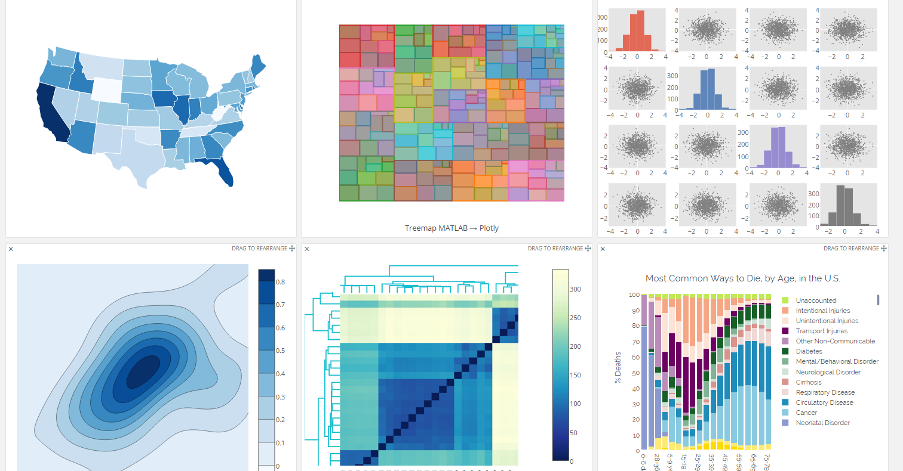

## Introduction

<iframe id="example1" src="https://imdevsoftware.wordpress.com/2016/02/28/network-visualization-with-plotly-and-shiny/" style="border: none; width: 100%; height: 500px" frameborder="0"></iframe>

## Networks as Visualization Tools

<iframe id="example2" src="http://dgrapov.github.io/MetaMapR/gallery.html" style="border: none; width: 100%; height: 500px" frameborder="0"></iframe>


## Network Visualization in R
### igraph
<iframe id="example2" src="http://igraph.org/" style="border: none; width: 100%; height: 500px" frameborder="0"></iframe>

#Lets Visualize a network
## Data set:
<iframe id="example2" src="https://networkdata.ics.uci.edu/data.php?id=105" style="border: none; width: 100%; height: 500px" frameborder="0"></iframe>

## igraph Karate Network
### https://networkdata.ics.uci.edu/data.php?id=105
```{r,message=FALSE,warning=FALSE}
library(igraph)
karate <- make_graph("Zachary")
karate$layout <- layout_with_kk(karate)
plot(karate)
```

## Identify Graph Modules
```{r}
fc <- cluster_fast_greedy(karate)
memb <- membership(fc)
plot(karate, vertex.color=memb)
```

## Network Objects
### edge list
```{r}
edge.list<-data.frame(get.edgelist(karate,names=TRUE))
edge.list$ID<-"friends"
head(edge.list)
```
### node attributes
```{r}
library(network)
nodes<-as.matrix(V(karate))
node.data<-data.frame(ID=nodes,group=as.matrix(memb))
#add color
node.data$color<-rainbow(length(unique(node.data$group)))[factor(node.data$group)]
#add size based on centrality
#rescale to 20-60
library(scales)
node.data$size<-rescale(closeness(karate, mode="all"),to=c(10,40))
head(node.data)
```

## Plotly


## Recreate Network in Plotly
```{r,eval=FALSE,message=FALSE,warning=FALSE}
library(networkly)

#net params
layout<-"kamadakawai"
type<-"2d"
color<-'color'
size<-'size'
name<-'ID'
obj<-get_network(edge.list,type=type,layout=layout)
#view
sapply(obj,head)
#create plotting attributes
net<-c(get_edges(obj,color=NULL,width=NULL,name=name,type=type,hoverinfo="none",showlegend=FALSE),
       get_nodes(obj,node.data,color=color,size=size,name=name,type=type,hoverinfo="ID",showlegend=FALSE),
       get_text(obj,node.data,text=name,extra=list(textfont=list(size=20)),type=type,yoff=-5,hoverinfo="none",showlegend=FALSE))


legend<-c(format_legend(obj,nodes=FALSE,node.data=node.data,width=NULL,size=NULL,name=name,color=NULL),#edge legend
          format_legend(obj,edges=FALSE,node.data=node.data,size=NULL,name=NULL,color="group")) #node legend
          

net2<-c(net,c(get_edges(legend,color=NULL,width=NULL,name=name,type=type,hoverinfo="none",showlegend=TRUE),
              get_nodes(legend,node.data=legend$node.data,color="group",size=NULL,name="group",type=type,showlegend=TRUE,merge=FALSE)))

net<-shiny_ly(net)
net<-shiny_ly(net2) # with legend?

plotly::layout(net,
       xaxis = list(title = "", showgrid = FALSE, showticklabels = FALSE, zeroline = FALSE, hoverformat = '.2f'),
       yaxis = list(title = "", showgrid = FALSE, showticklabels = FALSE, zeroline = FALSE, hoverformat = '.2f'))


```

<iframe src="./www/html/2d_plotly.html" style="border: none; width: 100%; height: 500px" frameborder="0"> </iframe>

## 3D Plotly Network
```{r,eval=FALSE,message=FALSE,warning=FALSE}
#net params
node.data$size<-rescale(closeness(karate, mode="all"),to=c(2,15)) # resize nodes for 3D
layout<-"kamadakawai"
type<-"3d"
color<-'color'
size<-'size'
name<-'ID'
obj<-get_network(edge.list,type=type,layout=layout)
#view
sapply(obj,head)
#create plotting attributes
net<-c(get_edges(obj,color=NULL,width=NULL,name=name,type=type,hoverinfo="none",showlegend=FALSE),
       get_nodes(obj,node.data,color=color,size=size,name=name,type=type,hoverinfo="ID",showlegend=FALSE),
       get_text(obj,node.data,text=name,extra=list(textfont=list(size=20)),type=type,yoff=-5,hoverinfo="none",showlegend=FALSE))


legend<-c(format_legend(obj,nodes=FALSE,node.data=node.data,width=NULL,size=NULL,name=name,color=NULL),#edge legend
          format_legend(obj,edges=FALSE,node.data=node.data,size=NULL,name=NULL,color="group")) #node legend


net2<-c(net,c(get_edges(legend,color=NULL,width=NULL,name=name,type=type,hoverinfo="none",showlegend=TRUE),
              get_nodes(legend,node.data=legend$node.data,color="group",size=NULL,name="group",type=type,showlegend=TRUE,merge=FALSE)))

net<-shiny_ly(net2) # with legend

plotly::layout(net,scene = list(showlegend=TRUE,
                        yaxis=list(showgrid=FALSE,showticklabels=FALSE,zeroline=FALSE,title=""),
                        xaxis=list(showgrid=FALSE,showticklabels=FALSE,zeroline=FALSE,title=""),
                        zaxis=list(showgrid=FALSE,showticklabels=FALSE,zeroline=FALSE,title="")))

```

<iframe src="./www/html/3d_plotly.html" style="border: none; width: 100%; height: 500px" frameborder="0"> </iframe>

## Embedding Networks in Shiny Apps
## `ui.R`
```{r,eval=FALSE}
shinyUI(bootstrapPage(
    plotlyOutput("network")
))

```
## `server.R` 
```{r,eval=FALSE}
shinyServer(function(session,input, output) {
  output$network<-renderPlotly({
    #network creation script goes here
    #see above for how to create 2d or 3d networks
    shiny_ly(net)
  })
})
```

## Shiny + Plotly Demo
```{r, eval=FALSE}
networkly::networklyShiny()
```

<iframe src="http://ec2-52-22-43-130.compute-1.amazonaws.com:3838/demos/networkly/" style="border: none; width: 100%; height: 500px" frameborder="0"> </iframe>

## Additional Resources
### `DiagrammeR`
#### For directed graphs +
<iframe src="https://github.com/rich-iannone/DiagrammeR" style="border: none; width: 100%; height: 500px" frameborder="0"> </iframe>

## About
* Last Updated: `r Sys.Date()`
* Contact: createdatasol@gmail.com

```{r,echo=FALSE}
sessionInfo()
```

